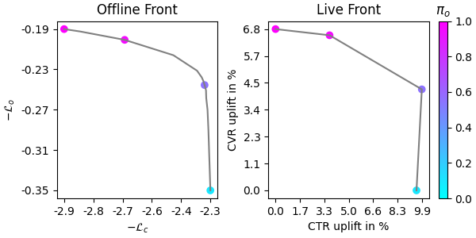
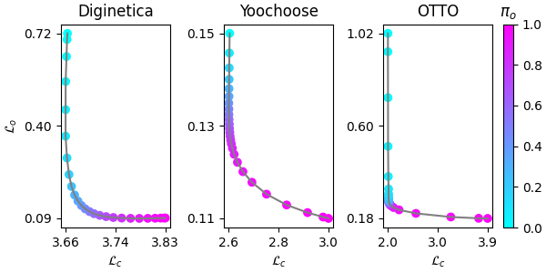
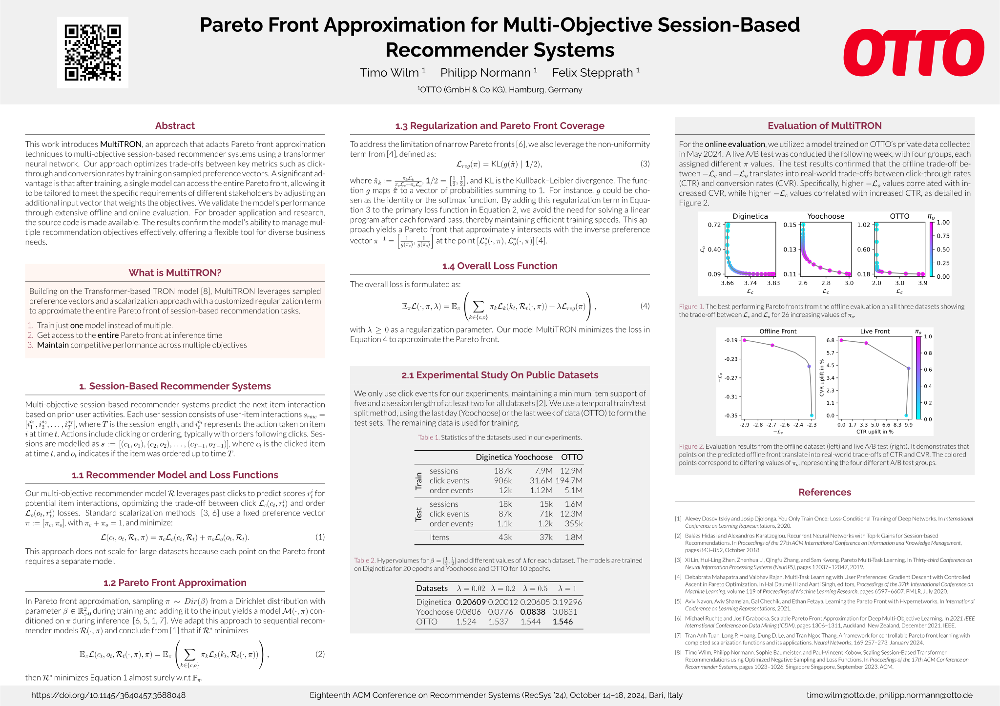

<div align="center">

# MultiTRON: Pareto Front Approximation for Multi-Objective Session-Based Recommendation

[](https://github.com/otto-de/MultiTRON)
[](https://github.com/otto-de/MultiTRON/actions/workflows/test.yml)
[](https://recsys.acm.org/recsys24/)
[](https://www.otto.de/jobs/technology/ueberblick/)

**MultiTRON is a session-based transformer capable of computing an efficient approximation of the Pareto front on multi-objective session-based recommendation tasks. This repository contains the official [PyTorch Lightning](https://github.com/Lightning-AI/lightning) implementation for our paper, accepted at ACM RecSys 2024: [_Pareto Front Approximation for Multi-Objective Session-Based Recommender Systems_](https://arxiv.org/abs/2407.16828), authored by  [Timo Wilm](https://www.linkedin.com/in/timo-wilm/), [Philipp Normann](https://www.linkedin.com/in/pnormann) and [Felix Stepprath](https://www.linkedin.com/in/felix-stepprath). Additionally, MultiTRON serves as backbone for our ACM RecSys 2025 contribution:
Identifying Offline Metrics that Predict Online Impact: A Pragmatic Strategy for Real-World Recommender Systems from  [Timo Wilm](https://www.linkedin.com/in/timo-wilm/) and [Philipp Normann](https://www.linkedin.com/in/pnormann).**


</div>

## 🎯 Abstract

This work introduces **MultiTRON**, an approach that adapts Pareto front approximation techniques to multi-objective session-based recommender systems using a transformer neural network. Our approach optimizes trade-offs between key metrics such as click-through and conversion rates by training on sampled preference vectors. A significant advantage is that after training, a single model can access the entire Pareto front, allowing it to be tailored to meet the specific requirements of different stakeholders by adjusting an additional input vector that weights the objectives. We validate the model’s performance through extensive offline and online evaluation. For broader application and research, the [source code](https://github.com/otto-de/MultiTRON) is made available. The results confirm the model’s ability to manage multiple recommendation objectives effectively, offering a flexible tool for diverse business needs.

<table>
  <tr>
    <td width="50%" align="center">
      
    </td>
    <td width="50%" align="center">
      <br>
    </td>
  </tr>
  <tr>
    <td>
      Evaluation results from the offline dataset and live A/B test. Points on the offline front translate into real-world trade-offs of CTR and CVR. The colored points correspond to differing values of preference vector, representing the four A/B test groups.
    </td>
    <td>
      The best performing Pareto fronts from the offline evaluation, which depicts 26 distinct points along the front to illustrate the tradeoffs between click loss and order loss across all three datasets: Diginetica, Yoochoose, and OTTO.
    </td>
  </tr>
</table>

## 🌟 RecSys 2024 Research Showcase

Below is our poster presented at the [18th ACM Conference on Recommender Systems](https://recsys.acm.org/recsys24/) (RecSys 2024), which provides a comprehensive overview of the key concepts, methodologies, and results of our MultiTRON research.

<a href=".readme/poster.pdf"></a>

## 🚀 Quick Start

1. Clone the repository:

```bash
git clone https://github.com/otto-de/MultiTRON.git
```

2. Install the dependencies:

```bash
pip install pipenv
pipenv install --dev
```

3. Execute the test scripts:

```bash
pipenv run pytest
```

4. Install 7zip, gzip, and zip utilities on your system:

```bash
sudo apt-get install 7zip gzip unzip
```

5. Prepare a dataset (e.g., diginetica, yoochoose or otto):

```bash
./prepare.sh yoochoose
```

6. Run the main script with a configuration file:

```bash
pipenv run python -m src --config-filename yoochoose/tron_200hs_3l_256bs_10epoch_beta05_reg05
```

7. After training compute the Pareto front for 25 points with the configuration file and a checkpoint:

```bash
pipenv run python -m src.pareto_front --config-filename yoochoose/tron_200hs_3l_256bs_10epoch_beta05_reg05 --checkpoint lightning_logs/version_1/checkpoints/multitron-yoochoose-epoch\=9-test_loss\=1.745.ckpt --number-points 25
```

8. To visualize the Pareto Front run:

```bash
pipenv run python -m src.visualize --parteo-front-filename pareto-front.json --plot True
```

## 🗂️ Repository Structure

```yaml
.
├── Pipfile
├── Pipfile.lock
├── README.md
├── configs                # Contains experiment configuration files
├── doc                    # Contains the paper and related files
├── prepare.sh             # Script to prepare datasets
├── src                    # Source code for the models, Pareto front and visualization
└── test                   # Test scripts
```

## ⚙️ Config File Documentation

The [config folder](configs/) contains JSON configuration files for all experiments performed in our research. These configurations detail the model's parameters and options.

Here's an explanation of each parameter in the config file:

- `dataset`: The dataset to be used for training (e.g., "diginetica", "yoochoose", "otto").
- `beta`: The two dimensionel diriclet vector to draw samples from during training.
- `regularization`: The penalty of the non-uniformity loss (approximated EPO loss) regularization term. 
- `hidden_size`: The size of the hidden layers and item embeddings.
- `num_layers`: The number of layers in the model.
- `dropout`: The dropout rate applied to the model's layers.
- `num_batch_negatives`: The number of negative samples from the batch. Limited by `batch_size` - 1.
- `num_uniform_negatives`: The number of uniformly sampled negatives.
- `reject_uniform_session_items`: If true, items from the same session won't be used as uniform negatives. Becomes slow if `num_uniform_negatives` is large.
- `reject_in_batch_items`: If true, items from the same session won't be used as batch negatives.
- `sampling_style`: The style of negative sampling to use (e.g., "eventwise", "sessionwise", "batchwise"). Has significant impact on training speed.
- `topk_sampling`: If true, top-k negative sampling is enabled.
- `topk_sampling_k`: If `topk_sampling` is true, this parameter specifies the number of top k negative samples to be used for training.
- `loss`: The loss function to use (e.g. "ssm_and_be" or "ssm_and_distortion" is implemented).
- `max_epochs`: The maximum number of training epochs.
- `batch_size`: The batch size used for training and validation.
- `max_session_length`: The maximum length of a session. Longer sessions will be truncated.
- `lr`: The learning rate for the optimizer.
- `limit_val_batches`: The fraction of validation data to use for the validation step.
- `accelerator`: The device type to be used for training (e.g., "gpu", "cpu").
- `overfit_batches`: The fraction or number of batches of training data to use for overfitting. Set to 0 for no overfitting. See [PyTorch Lightning docs](https://lightning.ai/docs/pytorch/stable/common/trainer.html#overfit-batches) for more details.
- `share_embeddings`: If true, the embedding weights are shared between the input and output layers.
- `output_bias`: If true, includes bias in the output layer.
- `shuffling_style`: The style of shuffling to use for the training dataset (e.g., "no_shuffling", "shuffling_with_replacement", "shuffling_without_replacement").
- `optimizer`: The optimizer to use for training (e.g., "adam", "adagrad")


### Example Config File for MultiTRON on the OTTO Dataset

```json
{
    "dataset": "otto",
    "beta": [0.5, 0.5],
    "regularization_penalty": 1.0,
    "hidden_size": 200,
    "num_layers": 3,
    "dropout": 0.05,
    "num_batch_negatives": 32,
    "num_uniform_negatives": 16384,
    "reject_uniform_session_items": false,
    "reject_in_batch_items": true,
    "sampling_style": "batchwise",
    "topk_sampling": true,
    "topk_sampling_k": 100,
    "loss": "ssm_and_be",
    "max_epochs": 10,
    "batch_size": 256,
    "max_session_length": 50,
    "lr": 0.0001,
    "limit_val_batches": 1.0,
    "accelerator": "gpu",
    "overfit_batches": 0,
    "share_embeddings": true,
    "output_bias": false,
    "shuffling_style": "no_shuffling",
    "optimizer": "adam"
}

```

For all config files used in our experiments, refer to the [configs directory](configs/).

## 🙌 Contribution

Contributions to MultiTRON are welcome and appreciated. For issues or suggestions for improvements, please open an issue or create a pull request. We believe that open source knowledge sharing is the best way to advance the field of recommender systems.

## 📖 Citing

If MultiTRON aids your research, please consider citing our work:

```bibtex
@inproceedings{wilm2024pareto,
  title={Pareto Front Approximation for Multi-Objective Session-Based Recommender Systems},
  author={Wilm, Timo and Normann, Philipp and Stepprath, Felix},
  booktitle={Proceedings of the 18th ACM Conference on Recommender Systems},
  doi = {10.1145/3640457.3688048},
  pages={809--812},
  year={2024}
}
```

## 📜 License

This project is [MIT licensed](./LICENSE).

## 📞 Contact

For any queries or questions, please reach out to us via our LinkedIn profiles:

- [Timo Wilm](https://www.linkedin.com/in/timo-wilm)
- [Philipp Normann](https://www.linkedin.com/in/pnormann/)


For specific issues related to the codebase or for feature requests, please create a new issue on our [GitHub page](https://github.com/otto-de/MULTITRON/issues).

If this project aids your research or you find it interesting, we would appreciate it if you could star ⭐ the repository. Thanks for your support!
